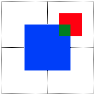

Python Geometry 
===============

[](https://badge.fury.io/py/simple-geometry)


Install
-------

```bash
pip install simple-geometry
```

Features
--------

- Create simple shapes
  - axis-aligned rectangles
  - axis-aligned path segments
  - groups containing other shapes
- Manipulate shapes
  - stretch align
  - translation align
- Visualize shapes

Read more in the [full documentation](https://unihd-cag.github.io/simple-geometry/).

Example
-------

```python
# Create some shapes
from geometry import Rect

big = Rect[100, 100, 'blue']
small = Rect[50, 50, 'red']

# Translate relatively

small.translate(center=big.top_right)

# Some topology

tiny = big.intersection(small).copy('green')

# Visualize them
from geometry import Canvas

c = Canvas(width=200, height=200)
c.append(big)
c.append(small)
c.append(tiny)

# This draws the shapes in jupyter notebook
c
```


